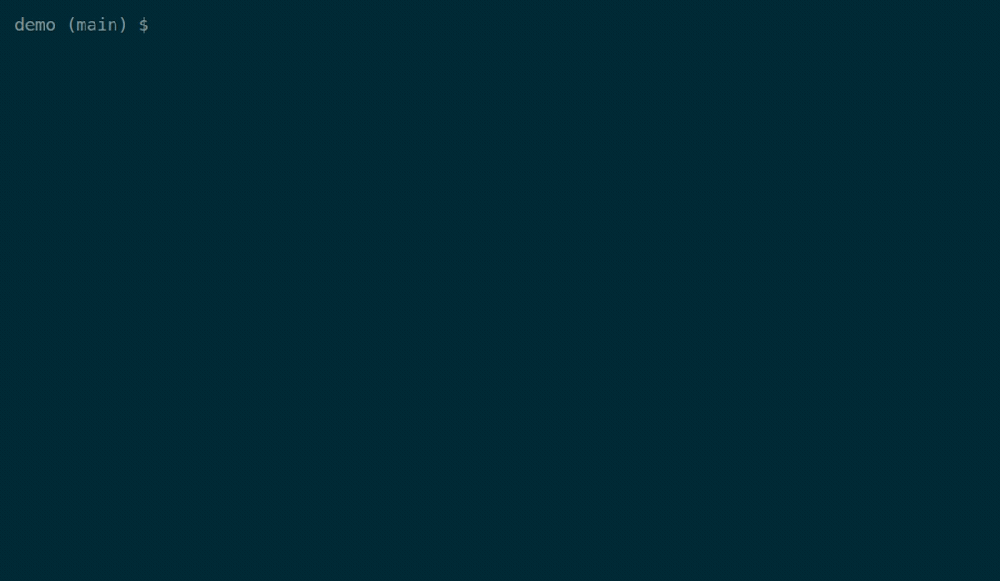

# hop

[](https://github.com/LarsMichelsen/hop/actions/workflows/ci.yml)

Helper for quick git branch hopping.

When you live in short-lived feature branches, switching between them with `git checkout` means
remembering names and typing them out. `hop` shows the branches you've touched most recently at the
top, so the one you want is almost always a keystroke away.



<sub>Recorded from a reproducible synthetic repo — see [`demo/PLAYBOOK.md`](demo/PLAYBOOK.md).</sub>

## Features

- Interactive text-based UI for browsing git branches
- List branches ordered by last commit date
- Show branch info: date, sync status, name, and last commit message
- Quick actions: checkout, rebase, delete, or create branches
- Shows upstream branch and merge status
- Vim-style navigation (arrow keys or j/k)

## Installation

Requires Python 3.12 or newer. Installation via `uv` recommended (isolated, added to PATH):

```bash
uv tool install git+https://github.com/LarsMichelsen/hop.git
```

## Updating

```bash
uv tool upgrade hop
```

## Usage

```bash
hop            # launch the interactive branch browser
hop --help     # show usage and exit
hop --version  # print the version and exit
```

### Controls

- `↑`/`↓` or `j`/`k` - Navigate branches
- `c` - Checkout selected branch
- `r` - Rebase selected branch onto its base
- `n` - Create new branch from selected branch
- `d` - Delete selected branch
- `h` - Show help screen
- `q` - Quit

## Configuration

`hop` reads an optional TOML file at `~/.config/hop/config.toml`. Everything in
it is optional. An absent file, section, or key falls back to the defaults
shown below. Create a documented starting point with:

```bash
hop init-config          # write ~/.config/hop/config.toml
hop init-config --force  # overwrite an existing file
```

```toml
[ui]
# Color theme. "auto" (default) honours $HOP_THEME, otherwise adapts to the
# terminal's ANSI palette. Also accepts "light", "dark", or any built-in
# Textual theme, e.g. "nord", "gruvbox", "dracula", "monokai", "tokyo-night",
# "catppuccin-mocha", "catppuccin-latte", "solarized-light", "flexoki".
theme = "auto"

[defaults]
# Prefix pre-filled in the "new branch" dialog when the source branch has no
# entry in [branch_prefixes].
branch_prefix = ""

[branch_prefixes]
# Per-source-branch prefixes: creating a branch from one of these pre-fills the
# input with the mapped prefix. Quote names containing slashes.
main = "feature/"
develop = "feat/"
# "release/v1.0" = "bugfix/"
```

| Setting | Purpose |
| --- | --- |
| `[ui] theme` | Color theme; `"auto"` adapts to the terminal. Toggle light/dark at runtime with `t`. |
| `[defaults] branch_prefix` | Default prefix for new branch names. |
| `[branch_prefixes]` | Prefix overrides keyed by the source branch you create from. |

## Development

```bash
# Install dependencies
uv sync

# Run the tool
uv run hop
```

See [docs/DEVELOPMENT.md](docs/DEVELOPMENT.md) for development workflow and pre-commit checks.

## License

[Apache License 2.0](LICENSE.md) © Lars Michelsen
